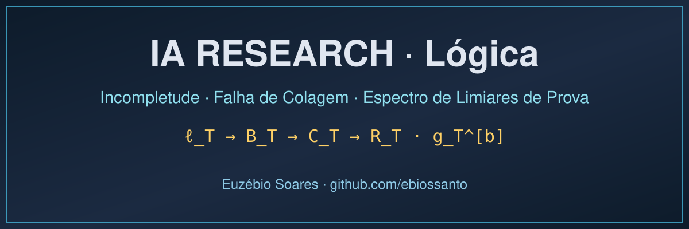

<p align="center">
  
</p>

# Projeto Lógica — Incompletude, Colagem e Espectro de Limiares de Prova

**Pesquisador:** Euzébio Soares · **Raiz do projeto:** `Desktop\Lógica\` · **Unificação:** 26/09/2026 · **Idioma:** português · **Repositório:** [`ebiossanto/IA-RESEARCH-Logica`](https://github.com/ebiossanto/IA-RESEARCH-Logica)

> **Citar este repositório:** use o [CITATION.cff](CITATION.cff) (botão *Cite this repository*) ou a seção [7. Citação](#7-citação) ao pé desta página.

Programa de pesquisa sobre (i) a impossibilidade de uma teoria certificar globalmente suas próprias verificações locais (*falha de colagem* / *perspectiva externa*) e (ii) o **espectro de limiares de prova** dos geradores de Krajíček (`ρ_T, B_T, C_T, R_T, g_T^[b]`, gadget `θ ↦ Φ_θ`).

---

## 1. Estrutura do projeto (4 pilares)

```
Lógica\
├── README.md                          ← este arquivo (mapa do projeto)
├── DOCUMENTO_CONTINUIDADE_PESQUISA.md ← histórico de decisões: de onde partimos / para onde vamos /
│                                        listas de prontos e a fazer
├── proofs\                            ← Pilar 3: rascunhos de lógica, provas e cadeias de pensamento
│   ├── Núcleo formal mínimo do espectro de limiares de prova.md
│   ├── desenv. logica kubricek leis.md
│   ├── mosaico custo logica goedel.md
│   ├── continuacao_falha_colagem_interna_v02.md
│   ├── custo_colagem_limites_reflexao_v03.md
│   └── principio_perspectiva_externa_logica.md
├── docs\                              ← documentação de linha
│   ├── ARSENAL_FERRAMENTAS.md     (ferramentas instaladas: caminhos, validação, armadilhas)
│   ├── documento_continuidade_perspectiva_colagem_reflexao_v1.md  (consolidado v1.0)
│   ├── logica  organização.md         (diagnóstico crítico + plano de 18 etapas)
│   ├── Lógica bibliografia kragicek.md (verificação de originalidade)
│   └── espectro-limiares\             (subprojeto numerado 01–05, ver §3)
├── src\
│   ├── julia\                         ← Pilar 2B: simulações pesadas e otimização (.jl)
│   └── python\                        ← Pilar 2A: verificação exata, estatística, gráficos (.py)
│       ├── verifica_espectro.py       (enumeração exaustiva: 410.155 perfis, 7.737.331 pares)
│       └── resultado_verificacao.txt  (saída congelada)
├── assets\
│   └── geogebra\                      ← Pilar 2C: modelagem geométrica dinâmica (.ggb / comandos)
└── paper\                             ← Pilar 4: artigo
    ├── main.tex                       (ambientes theorem/lemma/proof/align)
    ├── references.bib                 (chaves únicas AutorAno)
    └── figures\                       (figuras vetoriais .pdf/.eps, dpi=300)
```

## 2. Documento de continuidade

| Arquivo | Função |
|---|---|
| [`DOCUMENTO_CONTINUIDADE_PESQUISA.md`](DOCUMENTO_CONTINUIDADE_PESQUISA.md) | **Principal.** De onde partimos (intuição da ilha), para onde vamos (3 eixos), listas de prontos/a fazer, revisão matemática e correções. |
| [`docs/espectro-limiares/03_PRONTOS_E_A_FAZER.md`](docs/espectro-limiares/03_PRONTOS_E_A_FAZER.md) | Checklist operacional do subprojeto (B1–B4, marcos 1–5). |
| [`docs/espectro-limiares/04_CONTINUIDADE.md`](docs/espectro-limiares/04_CONTINUIDADE.md) | Relação com o projeto Gödel e com a linha da colagem. |
| [`docs/documento_continuidade_perspectiva_colagem_reflexao_v1.md`](docs/documento_continuidade_perspectiva_colagem_reflexao_v1.md) | Consolidado v1.0 da linha da colagem/reflexão. |
| [`docs/ARSENAL_FERRAMENTAS.md`](docs/ARSENAL_FERRAMENTAS.md) | **Arsenal computacional**: caminhos absolutos das ferramentas (Python/Julia/SPICE/LaTeX), comandos de verificação e armadilhas conhecidas do ambiente. |

## 3. Subprojeto `docs\espectro-limiares\` (leitura obrigatória)

| Ordem | Arquivo | Conteúdo |
|---|---|---|
| 1 | `README.md` | Mapa e **status por resultado** (verificado / condicionado / clássico / não iniciado). |
| 2 | `01_NUCLEO_DURO.md` | Definições + teoremas locais verificados (incl. `ρ` exato). |
| 3 | `01_ambiente_formal_e_codificacoes.md` | Convenções `D1–D11`: T, linguagem, `Prf_T`, `|·|`, lex, prefixo. |
| 4 | `02_REVISAO_CRITICA.md` | Auditoria item a item + verificação bibliográfica (Níveis A/B/C) + o que falta. |
| 5 | `03_PRONTOS_E_A_FAZER.md` | Checklist operacional com critérios de conclusão. |
| 6 | `04_CONTINUIDADE.md` | Correspondências com o projeto Gödel (colisão `ρ`, `g^{a,b}`, Lema 3 ↔ gadget). |
| 7 | `05_DESENVOLVIMENTO.md` | Comandos reproduzíveis, cobertura do script, regra de versionamento. |

## 4. Regras editorais e de prova (obrigatórias)

1. **Classificação A–D** em toda seção: A (definição) / B (lema elementar) / C (teorema condicionado) / D (conjectura).
2. Enquanto a busca bibliográfica (Etapa 17, `02_REVISAO_CRITICA.md` §4.2) não fechar: dizer **"possível contribuição original"**, nunca "novo".
3. **Pilar 3 — crivo antes de escrever seção do artigo:** (i) fase de ataque com contraexemplos (casos de borda: `k=1`, perfis vazios, `ℓ=∞`, orçamento nulo); (ii) cadeia de pensamento formal passo a passa gravada em `proofs\`.
4. **Pilar 4 — LaTeX:** só `align`/`equation` para fórmulas (nunca notação de texto); `\begin{theorem}`, `\begin{lemma}`, `\begin{proof}`; `references.bib` com chaves únicas `AutorAno`.
5. O script manda no texto, não o contrário: se `verifica_espectro.py` falhar, corrige-se `01_NUCLEO_DURO.md` (regra de versionamento, `05_DESENVOLVIMENTO.md` §6).

## 5. Comandos

```powershell
# Verificação exaustiva dos teoremas locais (~40 s; saída 0 = OK)
python "src\python\verifica_espectro.py"

# Compilar o artigo (a partir de paper\)
pdflatex main.tex && bibtex main && pdflatex main.tex && pdflatex main.tex
```

## 6. Próximo passo (herdado de `03_PRONTOS_E_A_FAZER.md` §B1)

**Etapa 1–2 (imediato, desbloqueia tudo):** fixar `q(Φ)` (`|Φ|+1` vs `|Φ|+2`), fixar T/linguagem/codificação, limpar ecos dos fontes e resolver a colisão de notação `ρ` com `ρ_b` do projeto Gödel.

## 7. Citação

Para citar este repositório, use o arquivo [`CITATION.cff`](CITATION.cff) (o GitHub o reconhece no botão *Cite this repository*) ou a entrada BibTeX abaixo:

```bibtex
@misc{soares2026-ia-research-logica,
  author       = {Soares, Euzébio},
  title        = {{IA {RESEARCH} --- Lógica: Incompletude, Falha de Colagem e Espectro de Limiares de Prova}},
  year         = {2026},
  howpublished = {\url{https://github.com/ebiossanto/IA-RESEARCH-Logica}},
  note         = {Repositório de pesquisa, versão de 1 de outubro de 2026}
}
```

**Banda de status dos resultados** (nomenclatura `docs/espectro-limiares/README.md`): núcleo local **verificado**; gadget de transferência e grau de Turing **condicionados**; P-1/Q1 **atacados parcialmente**; Q1-C **aberto**. Enquanto a busca bibliográfica não fechar, o que se admite publicamente é *"possível contribuição original"* — nunca "novo" (regra editorial §4.2).
